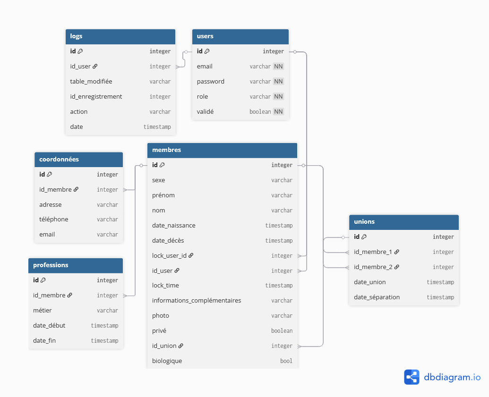

# 🗄️ Schéma de la base de données — Projet Genoa

## Diagramme ERD

---

## Tables

### Données métier

#### `membres`
Table centrale de l'application. Représente chaque personne de l'arbre généalogique.

| Colonne | Type | Contrainte | Description |
|---|---|---|---|
| id | integer | primary key | Identifiant unique |
| sexe | varchar | | Sexe du membre |
| prénom | varchar | | Prénom |
| nom | varchar | | Nom de famille |
| date_naissance | timestamp | | Date de naissance |
| date_décès | timestamp | | Date de décès (null si vivant) |
| lock_user_id | integer | ref → users.id | Verrou : qui est en train d'éditer |
| lock_time | timestamp | | Verrou : depuis quand |
| id_user | integer | ref → users.id | Compte utilisateur associé (null si aucun) |
| informations_complémentaires | varchar | | Notes libres |
| photo | varchar | | Chemin vers la photo |
| privé | boolean | | Membre public ou privé |
| id_union | integer | ref → unions.id | Union dont ce membre est issu (null si racine) |
| biologique | bool | | Enfant biologique ou adopté |

> 💡 Tout membre est potentiellement un enfant — `id_union` et `biologique` sont donc directement dans cette table. Ils sont `null` pour les racines de l'arbre (ancêtres sans parents connus).

---

#### `unions`
Représente une relation de couple entre deux membres. Sert de nœud intermédiaire entre les parents et leurs enfants.

| Colonne | Type | Contrainte | Description |
|---|---|---|---|
| id | integer | primary key | Identifiant unique |
| id_membre_1 | integer | ref → membres.id | Premier membre du couple |
| id_membre_2 | integer | ref → membres.id | Second membre du couple |
| date_union | timestamp | | Date d'union (optionnelle) |
| date_séparation | timestamp | | Date de séparation (null si toujours ensemble) |

> 💡 Un des deux membres peut être `null` si on sait qu'il y a eu une union sans connaître l'un des partenaires.

---

#### `coordonnées`
Stocke les coordonnées d'un membre. Table séparée car un membre peut en avoir plusieurs.

| Colonne | Type | Contrainte | Description |
|---|---|---|---|
| id | integer | primary key | Identifiant unique |
| id_membre | integer | ref → membres.id | Membre concerné |
| adresse | varchar | | Adresse postale |
| téléphone | varchar | | Numéro de téléphone |
| email | varchar | | Adresse email |

---

#### `professions`
Stocke les professions d'un membre. Table séparée car un membre peut en avoir eu plusieurs.

| Colonne | Type | Contrainte | Description |
|---|---|---|---|
| id | integer | primary key | Identifiant unique |
| id_membre | integer | ref → membres.id | Membre concerné |
| métier | varchar | | Intitulé du métier |
| date_début | timestamp | | Début de la profession |
| date_fin | timestamp | | Fin de la profession (null si actuelle) |

---

### Données techniques

#### `users`
Stocke les comptes utilisateurs de l'application.

| Colonne | Type | Contrainte | Description |
|---|---|---|---|
| id | integer | primary key | Identifiant unique |
| email | varchar | not null | Email de connexion (unique) |
| password | varchar | not null | Mot de passe chiffré |
| role | varchar | not null | "admin", "editeur" ou "lecteur" |
| validé | boolean | not null, default false | Compte validé par un admin |

---

#### `logs`
Historique de toutes les modifications effectuées dans l'application (piste d'audit).

| Colonne | Type | Contrainte | Description |
|---|---|---|---|
| id | integer | primary key | Identifiant unique |
| id_user | integer | ref → users.id | Utilisateur ayant effectué l'action |
| table_modifiée | varchar | | Nom de la table modifiée ("membres", "unions"…) |
| id_enregistrement | integer | | Id de la ligne modifiée dans cette table |
| action | varchar | | "création", "modification" ou "suppression" |
| date | timestamp | | Date et heure de l'action |

> 💡 `id_enregistrement` n'est pas une clé étrangère — c'est voulu, car on ne peut pas faire pointer une clé étrangère vers plusieurs tables différentes simultanément.

---

## Concepts clés

### Verrous (accès concurrent)
Deux colonnes dans `membres` gèrent les verrous : `lock_user_id` et `lock_time`. Quand un utilisateur commence à éditer un membre, le serveur y écrit son `id` et l'heure. Les autres utilisateurs voient que la ressource est occupée et reçoivent un message d'erreur.

### Nœud intermédiaire (union)
Un enfant n'est pas relié directement à ses deux parents, mais à leur **union**. Cela permet de gérer les parents inconnus (un seul `null` dans `unions` plutôt qu'un `null` répété pour chaque enfant).

### Séparation membres / users
Un `membre` est une personne dans l'arbre généalogique. Un `user` est un compte applicatif. Les deux sont distincts — un membre peut ne pas avoir de compte, et un utilisateur peut ne pas figurer dans l'arbre.
